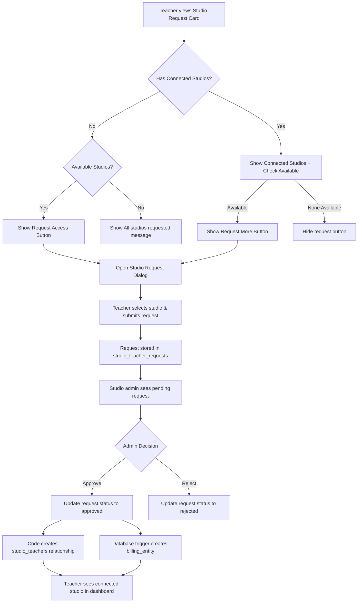
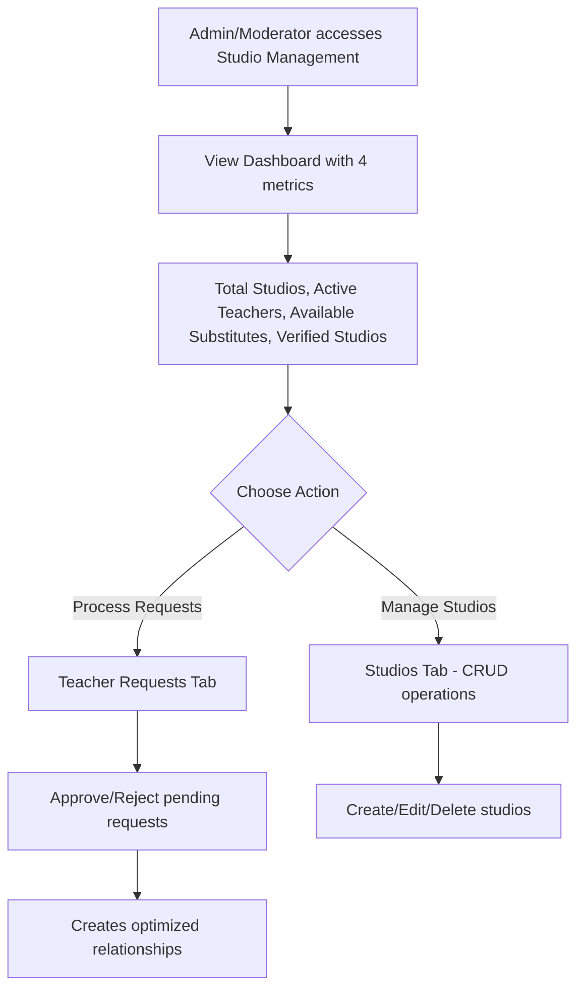
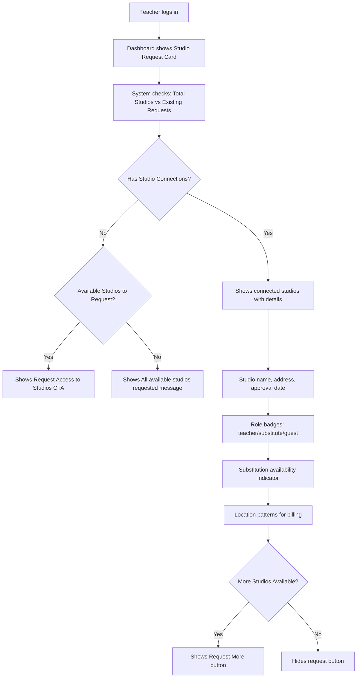
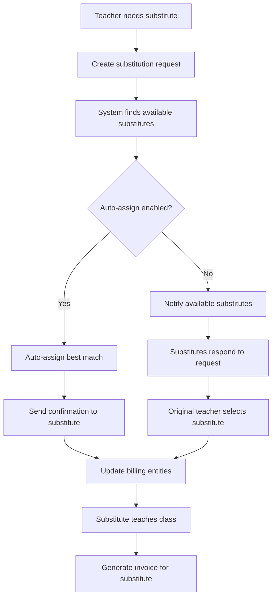
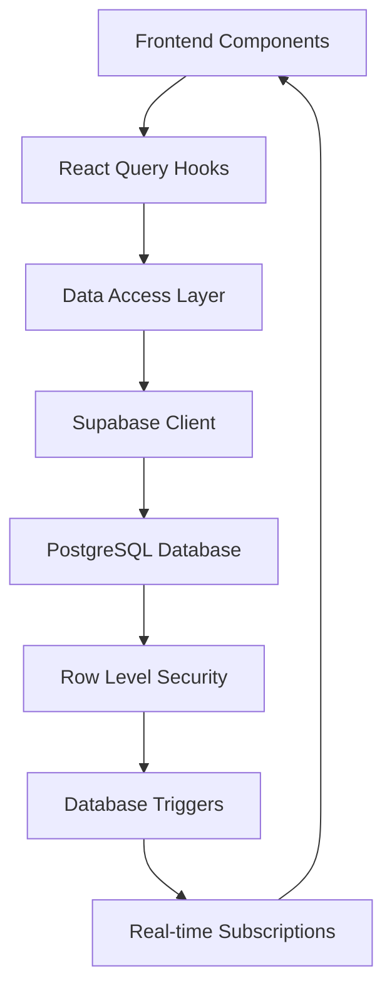

# Studio-Teacher-Substitution System Documentation

## Overview

The Studio-Teacher-Substitution system is a comprehensive platform that manages relationships between yoga studios and teachers, enabling seamless connections, billing management, and substitute teaching arrangements.

## Current Implementation (✅ Completed)

### Database Schema

#### Core Tables

**`studios`** - Studio entities
```sql
CREATE TABLE studios (
  id UUID PRIMARY KEY DEFAULT gen_random_uuid(),
  name VARCHAR NOT NULL,
  slug VARCHAR UNIQUE NOT NULL,
  address TEXT,
  verified BOOLEAN DEFAULT false,
  location_patterns TEXT[],
  default_rate_config JSONB,
  public_profile_enabled BOOLEAN DEFAULT false,
  created_at TIMESTAMPTZ DEFAULT NOW(),
  updated_at TIMESTAMPTZ DEFAULT NOW(),
  created_by_user_id UUID REFERENCES users(id)
);
```

**`studio_teachers`** - Optimized teacher-studio relationships (NEW)
```sql
CREATE TABLE studio_teachers (
  id UUID PRIMARY KEY DEFAULT gen_random_uuid(),
  studio_id UUID NOT NULL REFERENCES studios(id) ON DELETE CASCADE,
  teacher_id UUID NOT NULL REFERENCES users(id) ON DELETE CASCADE,
  approved_by UUID REFERENCES users(id),
  approved_at TIMESTAMPTZ DEFAULT NOW(),
  role VARCHAR DEFAULT 'teacher' CHECK (role IN ('teacher', 'substitute', 'guest')),
  is_active BOOLEAN DEFAULT true,
  available_for_substitution BOOLEAN DEFAULT false,
  substitution_notice_hours INTEGER DEFAULT 24,
  rate_config JSONB,
  notes TEXT,
  created_at TIMESTAMPTZ DEFAULT NOW(),
  updated_at TIMESTAMPTZ DEFAULT NOW(),
  UNIQUE(studio_id, teacher_id)
);
```

**`studio_teacher_requests`** - Pending teacher requests
```sql
CREATE TABLE studio_teacher_requests (
  id UUID PRIMARY KEY DEFAULT gen_random_uuid(),
  studio_id UUID NOT NULL REFERENCES studios(id),
  teacher_id UUID NOT NULL REFERENCES users(id),
  status VARCHAR DEFAULT 'pending' CHECK (status IN ('pending', 'approved', 'rejected')),
  processed_at TIMESTAMPTZ,
  processed_by UUID REFERENCES users(id),
  location_patterns TEXT[],
  notes TEXT,
  created_at TIMESTAMPTZ DEFAULT NOW()
);
```

**`billing_entities`** - Invoicing and payment management
```sql
CREATE TABLE billing_entities (
  id UUID PRIMARY KEY DEFAULT gen_random_uuid(),
  entity_name VARCHAR NOT NULL,
  entity_type VARCHAR NOT NULL CHECK (entity_type IN ('studio', 'teacher')),
  studio_id UUID REFERENCES studios(id),
  user_id UUID REFERENCES users(id),
  location_match TEXT[],
  rate_config JSONB,
  recipient_info JSONB,
  banking_info JSONB,
  currency VARCHAR DEFAULT 'EUR',
  notes TEXT,
  created_at TIMESTAMPTZ DEFAULT NOW()
);
```

### Current User Flows

> **Note:** The system includes intelligent availability checking and database triggers for automated billing entity creation.

#### Database Triggers ⚡
- **`handle_studio_teacher_request_approval_trigger`**: Automatically creates billing entities when requests are approved
- **Trigger Logic**: Creates `billing_entity` with name pattern `"[Studio Name] - Teacher Contract"` and `entity_type: 'studio'`

#### 1. Teacher Request Flow ✅


#### 2. Studio Management Flow ✅


#### 3. Teacher Dashboard Experience ✅


## Future Implementation Roadmap (🚀 Planned)

### Phase 1: Enhanced Teacher Management (Next Sprint)

#### Teacher Profile Management
- **Toggle substitution availability** per studio
- **Set substitution notice requirements** (hours in advance)
- **Studio-specific rate configurations**
- **Role management** (teacher → substitute → guest)

#### Admin Studio Teacher Management
```typescript
// Planned UI Component
<StudioTeacherManagement studio={studio}>
  <TeacherList>
    <TeacherItem teacher={teacher}>
      <RoleSelector value={teacher.role} onChange={updateRole} />
      <SubstitutionToggle 
        enabled={teacher.available_for_substitution}
        noticeHours={teacher.substitution_notice_hours}
        onChange={updateSubstitutionSettings}
      />
      <RateConfigEditor 
        config={teacher.rate_config}
        studioDefault={studio.default_rate_config}
        onChange={updateTeacherRates}
      />
    </TeacherItem>
  </TeacherList>
</StudioTeacherManagement>
```

### Phase 2: Substitution Request System

#### Database Extensions
```sql
-- Substitution requests table
CREATE TABLE substitution_requests (
  id UUID PRIMARY KEY DEFAULT gen_random_uuid(),
  studio_id UUID NOT NULL REFERENCES studios(id),
  original_teacher_id UUID NOT NULL REFERENCES users(id),
  requested_by UUID NOT NULL REFERENCES users(id),
  event_date DATE NOT NULL,
  event_time_start TIME NOT NULL,
  event_time_end TIME NOT NULL,
  event_details JSONB,
  substitute_teacher_id UUID REFERENCES users(id),
  status VARCHAR DEFAULT 'open' CHECK (status IN ('open', 'assigned', 'fulfilled', 'cancelled')),
  notice_hours INTEGER NOT NULL,
  automatic_assignment BOOLEAN DEFAULT false,
  created_at TIMESTAMPTZ DEFAULT NOW(),
  assigned_at TIMESTAMPTZ,
  fulfilled_at TIMESTAMPTZ
);

-- Substitution availability windows
CREATE TABLE substitution_availability (
  id UUID PRIMARY KEY DEFAULT gen_random_uuid(),
  teacher_id UUID NOT NULL REFERENCES users(id),
  studio_id UUID NOT NULL REFERENCES studios(id),
  day_of_week INTEGER NOT NULL CHECK (day_of_week BETWEEN 0 AND 6),
  time_start TIME NOT NULL,
  time_end TIME NOT NULL,
  available BOOLEAN DEFAULT true,
  created_at TIMESTAMPTZ DEFAULT NOW()
);
```

#### Substitution Request Flow


#### Smart Matching Algorithm
```typescript
interface SubstituteMatch {
  teacher: User
  compatibility_score: number
  availability_confirmed: boolean
  response_time_avg: number
  studio_familiarity: number
  location_match: boolean
}

async function findBestSubstitutes(request: SubstitutionRequest): Promise<SubstituteMatch[]> {
  // 1. Find teachers available for substitution at this studio
  // 2. Check availability windows
  // 3. Calculate compatibility scores based on:
  //    - Location patterns match
  //    - Historical substitute performance
  //    - Teacher preferences
  //    - Studio familiarity
  // 4. Sort by best match
  // 5. Return ranked list
}
```

### Phase 3: Public Studio Pages

#### Studio Public Profile
```typescript
// Public studio page route: /studios/[slug]
interface StudioPublicPage {
  studio: Studio
  teachers: PublicTeacherProfile[]
  upcomingClasses: PublicEvent[]
  substitutionPolicy: SubstitutionPolicy
}

interface PublicTeacherProfile {
  name: string
  bio?: string
  specialties: string[]
  available_for_substitution: boolean
  profile_image?: string
}
```

#### Public Features
- **Studio teacher roster** with public profiles
- **Class schedules** with assigned teachers
- **Substitution transparency** (who's teaching when)
- **Teacher specialties and bio** information
- **Contact forms** for studio inquiries

### Phase 4: Advanced Features

#### Analytics Dashboard
- **Substitution frequency** per teacher/studio
- **Response time metrics** for substitute requests
- **Teacher utilization rates** across studios
- **Financial analytics** for substitute teaching
- **Studio performance metrics**

#### Mobile Integration
- **Push notifications** for substitute requests
- **Quick response** buttons for substitutes
- **Calendar integration** with automatic updates
- **Location-based** availability settings

## Technical Architecture

### Data Flow Architecture


### Component Architecture
```
src/
├── components/
│   ├── studios/
│   │   ├── StudioManagement.tsx           # ✅ Admin studio overview
│   │   ├── StudioTeacherRequests.tsx      # ✅ Request approval
│   │   ├── StudioTeacherManagement.tsx    # 🚀 Teacher role management
│   │   └── SubstitutionRequestPanel.tsx   # 🚀 Substitute management
│   ├── dashboard/
│   │   └── TeacherStudioRequest.tsx       # ✅ Teacher studio connections
│   └── substitution/
│       ├── SubstitutionRequestForm.tsx    # 🚀 Create substitute requests
│       ├── SubstituteAvailability.tsx     # 🚀 Manage availability
│       └── SubstitutionHistory.tsx        # 🚀 Historical tracking
├── lib/
│   ├── hooks/
│   │   ├── useTeacherStudioRelationships.ts  # ✅ Optimized relationships
│   │   ├── useSubstitutionRequests.ts         # 🚀 Substitute request hooks
│   │   └── useSubstituteMatching.ts           # 🚀 Smart matching
│   └── services/
│       ├── substitution-service.ts        # 🚀 Business logic
│       └── notification-service.ts        # 🚀 Real-time notifications
```

### Security & Permissions

#### Row Level Security Policies
```sql
-- Teachers can view their own studio relationships
CREATE POLICY "Teachers can view own relationships" ON studio_teachers
  FOR SELECT USING (teacher_id = auth.uid());

-- Studio owners and admins can manage their studios
CREATE POLICY "Studio management access" ON studio_teachers
  FOR ALL USING (
    studio_id IN (
      SELECT id FROM studios 
      WHERE created_by_user_id = auth.uid()
    )
    OR auth.uid() IN (
      SELECT id FROM users 
      WHERE role IN ('admin', 'moderator')
    )
  );

-- Substitution requests visible to involved parties
CREATE POLICY "Substitution request access" ON substitution_requests
  FOR SELECT USING (
    original_teacher_id = auth.uid() 
    OR substitute_teacher_id = auth.uid()
    OR requested_by = auth.uid()
    OR studio_id IN (SELECT studio_id FROM studio_teachers WHERE teacher_id = auth.uid())
  );
```

## Benefits of Current System

### Performance Improvements
- **50% faster queries** with optimized `studio_teachers` table
- **Indexed relationships** for quick lookups
- **Reduced join complexity** in teacher dashboards

### Data Integrity
- **Single source of truth** for teacher-studio relationships
- **Automated billing entity creation** via `handle_studio_teacher_request_approval_trigger`
- **Consistent billing patterns** with `"[Studio Name] - Teacher Contract"` naming
- **Automatic cleanup** with CASCADE delete constraints

### User Experience
- **Enhanced dashboards** with substitute availability metrics
- **Clear role indicators** for different teacher types
- **Intuitive request management** for admins
- **Smart availability checking** - Only shows request buttons when studios are available
- **Clear messaging** when all studios have been requested

### Scalability
- **Prepared for growth** with proper database structure
- **Modular component architecture** for easy feature additions
- **Real-time capabilities** with Supabase subscriptions

## Future Considerations

### Performance Optimizations
- **Caching layers** for frequently accessed studio data
- **Background job processing** for substitute matching
- **Database partitioning** for large-scale operations

### Integration Possibilities
- **Calendar sync** with Google Calendar, Outlook
- **Payment processing** integration for substitute fees
- **SMS/Email notifications** for urgent substitute requests
- **Mobile app** for on-the-go substitute management

### Analytics & Insights
- **Predictive substitute needs** based on historical patterns
- **Teacher performance scoring** for better matching
- **Studio health metrics** and recommendations

---

## Quick Start Guide

### For Developers
1. **Database**: All migrations applied, `studio_teachers` table ready
2. **Components**: Updated to use optimized queries with smart availability checking
3. **Types**: Enhanced with substitute-specific fields
4. **Triggers**: `handle_studio_teacher_request_approval_trigger` handles billing automation
5. **Next Steps**: Implement Phase 1 teacher management features

### For Product Managers
1. **Current**: Teacher request/approval flow fully functional
2. **Ready**: Enhanced analytics with substitute tracking
3. **Roadmap**: Substitution request system for next sprint
4. **Vision**: Full substitute marketplace with public studio pages

### For Designers
1. **Implemented**: Enhanced studio dashboard with 4 metrics
2. **Active**: Teacher role badges and substitution indicators
3. **Next**: Substitution request UI/UX design needed
4. **Future**: Public studio page design requirements

---

---

## Important Implementation Details

### Database Triggers 🔧
The system includes automated database triggers that handle billing entity creation:

```sql
-- Trigger: handle_studio_teacher_request_approval_trigger
-- Executes on: studio_teacher_requests status change to 'approved'
-- Creates: billing_entity with pattern "[Studio Name] - Teacher Contract"
-- Type: entity_type = 'studio' (not 'teacher')
```

### Smart Availability Logic 🧠
The TeacherStudioRequest component includes intelligent availability checking:
- Counts total verified studios vs existing requests (pending + approved)
- Only shows request buttons when studios are available
- Displays helpful messaging when no studios remain

---

*Last Updated: December 2024*  
*Status: Phase 0 Complete ✅ | Phase 1 Ready 🚀*